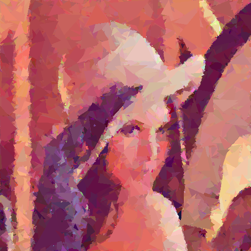

# Genetic Algorithm Image Recreation - Lenna

This project recreates the famous Lenna image using a genetic algorithm, where each chromosome is a list of triangles drawn on a canvas.

## Main Features

-   **Goal:** Recreate a target image (e.g., Lenna) by evolving a population of images composed of random triangles.
-   **Chromosome:** A list of triangles (each defined by 3 vertices and RGBA color).
-   **Fitness:** Negative Mean Squared Error (MSE) between the generated and target image. The lower the error, the better the fitness.
-   **Algorithm:** Classic genetic algorithm: tournament selection, crossover (blend/point), mutation.
-   **Rendering:** Fast triangle drawing and image operations using numpy + OpenCV (cv2).
-   **Visualization:** Live progress shown in an OpenCV window (target on the left, best chromosome on the right).
-   **Saving:** Every 50 generations, the best image is saved to the `results` directory.
-   **Video Creation:** The `scripts.py` script can combine saved images into an MP4 video.

## Project Structure

-   `main.py` – main entry point, runs evolution and displays progress.
-   `chromosome.py` – chromosome definition (list of triangles, fitness, drawing).
-   `triangle.py` – triangle definition, generation, mutation, drawing.
-   `population.py` – population management, selection, crossover, mutation.
-   `config.py` – configuration parameters (image size, number of triangles, population size, etc.).
-   `scripts.py` – script for generating a video from saved images.
-   `results/` – directory with saved best chromosomes.

## How to Run?

1. Make sure you have all required libraries:
    ```bash
    pip install -r requirements.txt
    ```
2. Place `lenna.png` in the project directory.
3. Start the evolution:
    ```bash
    python main.py
    ```
4. Watch the progress in the OpenCV window. The best images are saved every 50 generations.
5. After finishing, you can generate a progress video:
    ```bash
    python scripts.py
    ```

## Configuration

You can change parameters in `config.py`, such as:

-   Image size (`IMAGE_WIDTH`, `IMAGE_HEIGHT`)
-   Number of triangles (`NUMBER_OF_TRIANGLES`)
-   Population size (`POPULATION_SIZE`)
-   Number of generations (`GENERATIONS`)
-   Image saving frequency

## Example Result

-   After several thousand generations, the right image starts to resemble the original.
-   You can send the progress video to Discord (if the file is too large, reduce resolution or frame rate in `scripts.py`).

| Target (lenna.png)  |              Example generated image               |
| :-----------------: | :------------------------------------------------: |
|  |  |

# Algorytm genetyczny do rekonstrukcji obrazu Lenna

Projekt polega na rekonstrukcji obrazu Lenna za pomocą algorytmu genetycznego, w którym chromosomem jest lista trójkątów rysowanych na obrazie.

## Główne założenia

-   **Cel:** Odtworzenie zadanego obrazu (np. Lenna) poprzez ewolucję populacji obrazów złożonych z losowych trójkątów.
-   **Chromosom:** Lista trójkątów (współrzędne 3 wierzchołków + kolor RGBA).
-   **Fitness:** Negatywna wartość MSE (Mean Squared Error) pomiędzy obrazem generowanym a oryginałem. Im mniejszy błąd, tym lepszy fitness.
-   **Algorytm:** Klasyczny algorytm genetyczny: selekcja turniejowa, krzyżowanie (blend/point crossover), mutacja.
-   **Rysowanie:** Szybkie rysowanie trójkątów i operacje na obrazach realizowane są w numpy + OpenCV (cv2).
-   **Wyświetlanie:** Postęp ewolucji prezentowany jest na żywo w oknie OpenCV (po lewej oryginał, po prawej najlepszy chromosom).
-   **Zapis:** Co 50 generacji najlepszy obraz jest zapisywany do katalogu `results`.
-   **Tworzenie filmiku:** Skrypt `scripts.py` pozwala połączyć zapisane obrazy w film MP4.

## Struktura projektu

-   `main.py` – główny plik uruchamiający ewolucję i wyświetlający postęp.
-   `chromosome.py` – definicja chromosomu (lista trójkątów, fitness, rysowanie).
-   `triangle.py` – definicja trójkąta, generowanie, mutacja, rysowanie.
-   `population.py` – obsługa populacji, selekcja, krzyżowanie, mutacje.
-   `config.py` – parametry konfiguracyjne (rozmiar obrazu, liczba trójkątów, populacja, itp.).
-   `scripts.py` – skrypt do generowania filmiku z zapisanych obrazów.
-   `results/` – katalog z zapisanymi obrazami najlepszych chromosomów.

## Jak uruchomić?

1. Upewnij się, że masz zainstalowane wymagane biblioteki:
    ```bash
    pip install -r requirements.txt
    ```
2. Umieść plik `lenna.png` w katalogu projektu.
3. Uruchom ewolucję:
    ```bash
    python main.py
    ```
4. Obserwuj postęp w oknie OpenCV. Najlepsze obrazy będą zapisywane co 50 generacji.
5. Po zakończeniu możesz wygenerować filmik z postępu:
    ```bash
    python scripts.py
    ```

## Parametry konfiguracyjne

W pliku `config.py` możesz zmieniać m.in.:

-   Rozmiar obrazu (`IMAGE_WIDTH`, `IMAGE_HEIGHT`)
-   Liczbę trójkątów (`NUMBER_OF_TRIANGLES`)
-   Rozmiar populacji (`POPULATION_SIZE`)
-   Liczbę generacji (`GENERATIONS`)
-   Częstotliwość zapisu obrazów

## Przykładowy efekt

-   Po kilku tysiącach generacji obraz po prawej zaczyna przypominać oryginał.
-   Filmik z postępu możesz wysłać np. na Discorda (jeśli plik jest za duży, zmniejsz rozdzielczość lub liczbę klatek w `scripts.py`).

| Oryginał (lenna.png) |         Przykładowy obraz wygenerowany         |
| :------------------: | :--------------------------------------------: |
|   |  |
